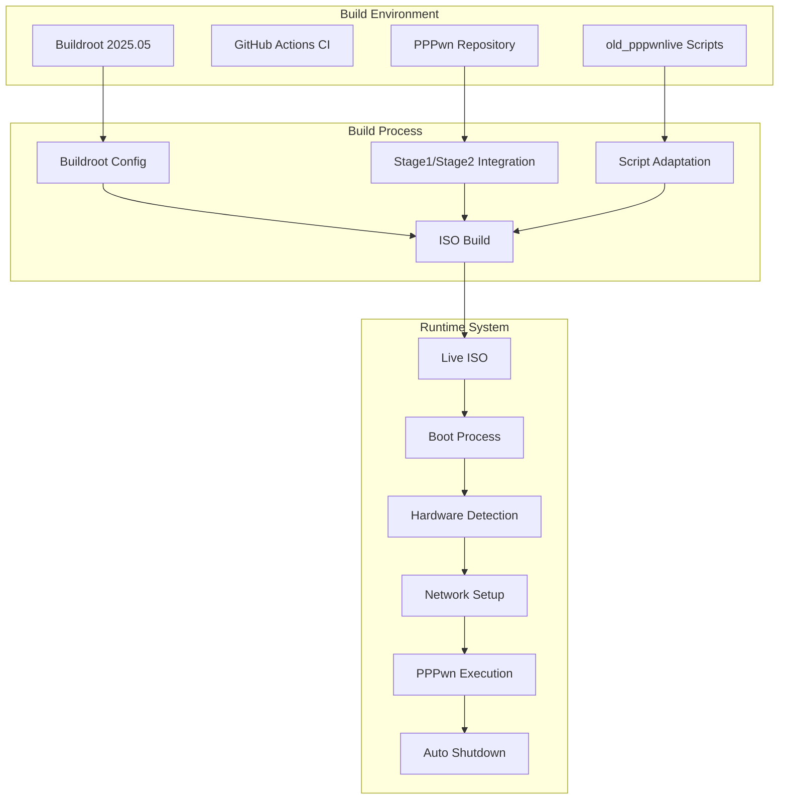

# Design Document

## Overview

The pppwn_live system will be redesigned as a Buildroot-based Linux live ISO that automatically executes the PPPwn PS4 exploit. The system will transition from Alpine Linux to Buildroot for better control over the minimal system configuration, improved build reproducibility, and more efficient CI/CD integration.

The architecture will maintain the core functionality of the existing Alpine-based system while leveraging Buildroot's package management and overlay system for cleaner integration of PPPwn components and custom configurations.

## Architecture

### System Architecture



### Component Architecture

1. **External Dependencies**
   - Buildroot source (fetched from GitHub during CI)
   - PPPwn stage1/stage2 payloads (integrated as packages)
   - Hardware drivers and network utilities

2. **Custom Components**
   - Buildroot packages for PPPwn integration
   - Filesystem overlays for configuration
   - Boot scripts and automation
   - User interface and status reporting

3. **Runtime Components**
   - Minimal Linux kernel with network drivers
   - PPPwn exploit binaries and payloads
   - Network detection and configuration
   - User guidance and status display

## Components and Interfaces

### Buildroot Package Structure

```
buildroot-packages/
├── pppwn-stage1/
│   ├── Config.in
│   ├── pppwn-stage1.mk
│   └── pppwn-stage1.hash
├── pppwn-stage2/
│   ├── Config.in
│   ├── pppwn-stage2.mk
│   └── pppwn-stage2.hash
└── pppwn-cpp/
    ├── Config.in
    ├── pppwn-cpp.mk
    └── pppwn-cpp.hash
```

### Filesystem Overlay Structure

```
buildroot-overlay/
├── etc/
│   ├── init.d/
│   │   ├── S99pppwn-setup
│   │   └── S98network-detect
│   ├── profile.d/
│   │   └── pppwn-motd.sh
│   └── pppwn/
│       └── config
├── root/
│   └── .profile
└── usr/
    ├── bin/
    │   ├── pppwn-runner
    │   ├── network-detector
    │   └── status-display
    └── share/
        └── pppwn/
            ├── stage1/
            └── stage2/
```

### Interface Definitions

#### PPPwn Package Interface
```makefile
# pppwn-cpp.mk interface
PPPWN_CPP_VERSION = latest
PPPWN_CPP_SITE = https://github.com/xfangfang/PPPwn_cpp
PPPWN_CPP_SITE_METHOD = git
PPPWN_CPP_DEPENDENCIES = host-cmake
```

#### Network Detection Interface
```bash
# network-detector script interface
detect_ps4_interface() {
    # Returns: interface name or empty string
}

configure_interface() {
    # Input: interface name
    # Returns: 0 on success, 1 on failure
}
```

#### Status Display Interface
```bash
# status-display script interface
show_status() {
    # Input: status_code, message
    # Output: formatted status display
}

show_progress() {
    # Input: percentage, current_step
    # Output: progress indicator
}
```

## Data Models

### Configuration Data Model

```yaml
# /etc/pppwn/config
system:
  hostname: "PPPwnLive"
  auto_shutdown: true
  timeout_seconds: 300

network:
  interface_patterns:
    - "eth*"
    - "en*"
  dhcp_timeout: 30
  detection_retries: 3

exploit:
  firmware_version: "1100"
  stage1_path: "/usr/share/pppwn/stage1/"
  stage2_path: "/usr/share/pppwn/stage2/"
  binary_path: "/usr/bin/pppwn"
  retry_attempts: 3
  retry_delay: 5

display:
  clear_screen: true
  show_banner: true
  verbose_output: true
  color_output: true
```

### Build Configuration Data Model

```make
# Buildroot defconfig structure
BR2_x86_64=y
BR2_TOOLCHAIN_BUILDROOT_GLIBC=y
BR2_TARGET_GENERIC_HOSTNAME="pppwnlive"
BR2_TARGET_GENERIC_ISSUE="PPPwn Live System"
BR2_ROOTFS_OVERLAY="$(BR2_EXTERNAL_PPPWN_PATH)/overlay"
BR2_ROOTFS_POST_BUILD_SCRIPT="$(BR2_EXTERNAL_PPPWN_PATH)/post-build.sh"
BR2_LINUX_KERNEL=y
BR2_LINUX_KERNEL_CUSTOM_VERSION=y
BR2_LINUX_KERNEL_CUSTOM_VERSION_VALUE="6.6.x"
BR2_PACKAGE_PPPWN_CPP=y
BR2_PACKAGE_PPPWN_STAGE1=y
BR2_PACKAGE_PPPWN_STAGE2=y
```

## Error Handling

### Build-Time Error Handling

1. **External Dependency Failures**
   - Buildroot download failures: Retry with exponential backoff
   - PPPwn repository access issues: Use cached versions with warnings
   - Package compilation errors: Fail fast with detailed logs

2. **Configuration Validation**
   - Invalid defconfig: Validate against Buildroot schema
   - Missing overlay files: Check file existence before build
   - Package dependency conflicts: Resolve automatically or fail with guidance

### Runtime Error Handling

1. **Hardware Detection Failures**
   - No network interfaces: Display error message and manual instructions
   - Interface configuration failures: Try alternative interfaces
   - PS4 detection timeout: Retry with user guidance

2. **Exploit Execution Errors**
   - Binary execution failures: Display troubleshooting steps
   - Network communication errors: Retry with different parameters
   - Payload loading errors: Verify file integrity and retry

3. **System Recovery**
   - Critical failures: Provide emergency shell access
   - Timeout scenarios: Automatic shutdown with status display
   - User intervention: Clear instructions for manual recovery

### Error Reporting Strategy

```bash
# Error reporting interface
report_error() {
    local error_code="$1"
    local error_message="$2"
    local suggested_action="$3"
    
    echo "ERROR [$error_code]: $error_message"
    echo "SUGGESTION: $suggested_action"
    log_error "$error_code" "$error_message"
}

log_error() {
    # Log to system journal and/or file
    logger -t pppwn "ERROR: $1 - $2"
}
```

## Testing Strategy

### Build Testing

1. **Continuous Integration Testing**
   - Matrix builds for different Buildroot versions
   - Package compilation verification
   - ISO generation and basic boot testing
   - Dependency resolution validation

2. **Integration Testing**
   - Full build pipeline execution
   - Artifact generation verification
   - Configuration validation
   - Overlay application testing

### Runtime Testing

1. **Boot Testing**
   - QEMU-based boot verification
   - Hardware detection simulation
   - Network interface mocking
   - Service startup validation

2. **Functional Testing**
   - PPPwn binary execution (without PS4)
   - Network configuration testing
   - User interface display verification
   - Shutdown sequence testing

3. **End-to-End Testing**
   - Full exploit execution simulation
   - Error scenario handling
   - Recovery mechanism testing
   - Performance benchmarking

### Test Automation Framework

```yaml
# GitHub Actions test matrix
strategy:
  matrix:
    buildroot_version: ["2025.05"]
    architecture: ["x86_64"]
    test_type: ["build", "boot", "functional"]

test_steps:
  - name: Build Test
    run: |
      make pppwn_defconfig
      make all
      
  - name: Boot Test
    run: |
      qemu-system-x86_64 -cdrom output/images/pppwn_live.iso -nographic -m 512M
      
  - name: Functional Test
    run: |
      ./test/functional-tests.sh
```

## Implementation Phases

### Phase 1: Buildroot Foundation
- Set up Buildroot external tree structure
- Create basic defconfig for x64 minimal system
- Implement CI/CD pipeline for Buildroot fetching
- Create basic filesystem overlay structure

### Phase 2: PPPwn Integration
- Develop Buildroot packages for PPPwn components
- Integrate stage1/stage2 payload management
- Adapt existing scripts for Buildroot environment
- Implement network detection and configuration

### Phase 3: User Experience
- Port user interface and status display
- Implement automatic shutdown sequence
- Add error handling and recovery mechanisms
- Create comprehensive testing framework

### Phase 4: Optimization and Hardening
- Minimize system footprint
- Optimize boot time and execution speed
- Implement security hardening measures
- Add comprehensive documentation and troubleshooting guides