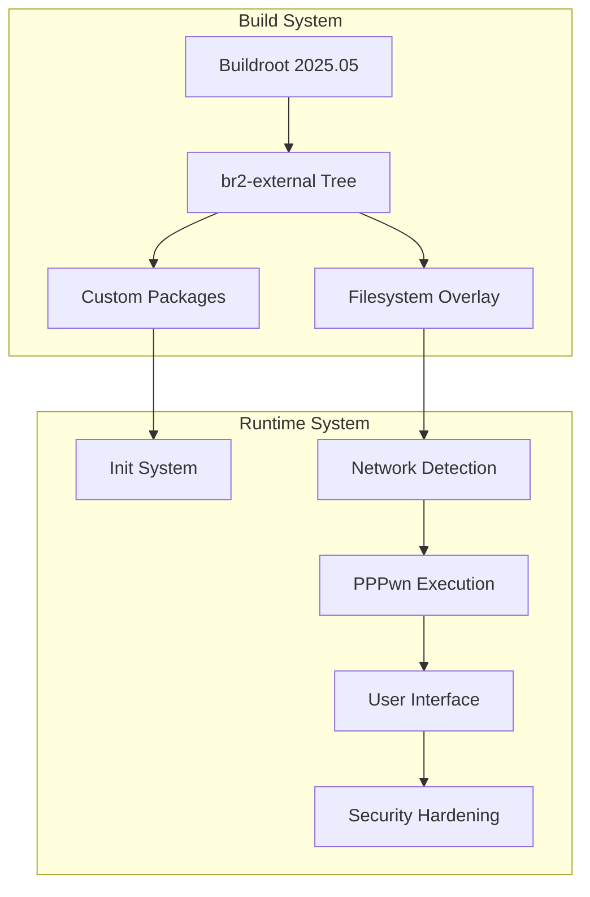

# Developer Documentation

This document provides detailed information for developers who want to extend, modify, or contribute to the PPPwn Live ISO project.

## Table of Contents
- [Architecture Overview](#architecture-overview)
- [Development Environment](#development-environment)
- [Buildroot Integration](#buildroot-integration)
- [Custom Packages](#custom-packages)
- [Filesystem Overlay](#filesystem-overlay)
- [Testing Framework](#testing-framework)
- [CI/CD Pipeline](#cicd-pipeline)
- [Debugging and Troubleshooting](#debugging-and-troubleshooting)
- [Contributing Guidelines](#contributing-guidelines)

## Architecture Overview

### System Components



### Key Design Principles

1. **Minimalism**: Include only essential components
2. **Security**: Harden system against attacks
3. **Automation**: Minimize user interaction required
4. **Reliability**: Robust error handling and recovery
5. **Maintainability**: Clean, documented code structure

## Development Environment

### Prerequisites

```bash
# Ubuntu/Debian
sudo apt-get update
sudo apt-get install -y \
    build-essential git wget cpio unzip rsync bc \
    libncurses5-dev libssl-dev python3 python3-distutils \
    qemu-system-x86 qemu-utils

# Development tools
sudo apt-get install -y \
    vim-common shellcheck yamllint \
    docker.io docker-compose
```

### Setting Up Development Environment

```bash
# Clone repository
git clone https://github.com/your-org/pppwn-live-iso.git
cd pppwn-live-iso

# Initialize Buildroot
make pppwn_defconfig

# Optional: Customize configuration
make menuconfig
make linux-menuconfig
make busybox-menuconfig

# Build system
make all
```

### Development Workflow

1. **Make changes** to packages, overlay, or configuration
2. **Test locally** using QEMU or real hardware
3. **Run validation tests** to ensure functionality
4. **Submit pull request** with comprehensive description

## Buildroot Integration

### External Tree Structure

```
br2-external/
├── Config.in              # Package configuration menu
├── external.desc          # External tree metadata
├── external.mk            # Top-level makefile
├── configs/               # System configurations
├── overlay/               # Filesystem overlay
├── package/               # Custom packages
└── scripts/               # Build scripts
```

### Configuration Management

**Main Configuration** (`configs/pppwn_defconfig`):
```make
# Architecture and toolchain
BR2_x86_64=y
BR2_TOOLCHAIN_BUILDROOT_GLIBC=y

# System configuration
BR2_TARGET_GENERIC_HOSTNAME="pppwnlive"
BR2_TARGET_GENERIC_ISSUE="PPPwn Live System"
BR2_ROOTFS_OVERLAY="$(BR2_EXTERNAL_PPPWN_PATH)/overlay"

# Kernel configuration
BR2_LINUX_KERNEL=y
BR2_LINUX_KERNEL_CUSTOM_VERSION=y
BR2_LINUX_KERNEL_CUSTOM_VERSION_VALUE="6.6.x"
BR2_LINUX_KERNEL_CONFIG_FRAGMENT_FILES="$(BR2_EXTERNAL_PPPWN_PATH)/configs/linux.config"

# Custom packages
BR2_PACKAGE_PPPWN_CPP=y
BR2_PACKAGE_PPPWN_STAGE1=y
BR2_PACKAGE_PPPWN_STAGE2=y

# ISO generation
BR2_TARGET_ROOTFS_CPIO=y
BR2_TARGET_ROOTFS_CPIO_GZIP=y
BR2_TARGET_ROOTFS_ISO9660=y
```

### Adding New Configuration Options

1. **Edit `Config.in`** to add menu options
2. **Update defconfig** with new settings
3. **Test configuration** with `make menuconfig`
4. **Document changes** in commit message

## Custom Packages

### Package Structure

Each custom package follows Buildroot conventions:

```
package/pppwn-example/
├── Config.in              # Package configuration
├── pppwn-example.mk      # Package makefile
└── pppwn-example.hash    # Source verification
```

### Creating New Packages

**Example Package Makefile** (`pppwn-example.mk`):
```make
################################################################################
#
# pppwn-example
#
################################################################################

PPPWN_EXAMPLE_VERSION = 1.0.0
PPPWN_EXAMPLE_SITE = https://github.com/example/pppwn-example
PPPWN_EXAMPLE_SITE_METHOD = git
PPPWN_EXAMPLE_LICENSE = GPL-3.0
PPPWN_EXAMPLE_LICENSE_FILES = LICENSE

define PPPWN_EXAMPLE_BUILD_CMDS
    $(MAKE) $(TARGET_CONFIGURE_OPTS) -C $(@D) all
endef

define PPPWN_EXAMPLE_INSTALL_TARGET_CMDS
    $(INSTALL) -D -m 0755 $(@D)/pppwn-example $(TARGET_DIR)/usr/bin/pppwn-example
endef

$(eval $(generic-package))
```

**Package Configuration** (`Config.in`):
```kconfig
config BR2_PACKAGE_PPPWN_EXAMPLE
    bool "pppwn-example"
    help
      Example PPPwn package for demonstration.
      
      https://github.com/example/pppwn-example
```

### Existing Custom Packages

#### pppwn-cpp
- Downloads and compiles PPPwn C++ binary
- Handles cross-compilation for x64 target
- Installs binary to `/usr/bin/pppwn`

#### pppwn-stage1/pppwn-stage2
- Downloads stage payloads from PPPwn repository
- Verifies payload integrity with hash checking
- Installs payloads to `/usr/share/pppwn/`

## Filesystem Overlay

### Overlay Structure

```
overlay/
├── etc/
│   ├── init.d/           # Init scripts
│   ├── profile.d/        # Shell profile scripts
│   └── pppwn/           # PPPwn configuration
├── root/
│   └── .profile         # Root user profile
└── usr/
    ├── bin/             # Custom binaries
    └── share/           # Shared data
```

### Adding Custom Files

1. **Create file** in appropriate overlay directory
2. **Set correct permissions** (executable scripts need +x)
3. **Test integration** with build and runtime testing
4. **Document purpose** in code comments

### Init System Integration

**Service Dependencies**:
```
S01security-hardening     # System hardening
S02periodic-memory-clear  # Memory security
S95pppwn-setup           # PPPwn initialization
S96service-monitor       # Service monitoring
S98network-detect        # Network detection
S99secure-shutdown       # Shutdown handling
```

**Creating New Init Scripts**:
```bash
#!/bin/sh
#
# Service Name: Example Service
# Description: Example init script
#

case "$1" in
    start)
        echo "Starting example service..."
        # Start logic here
        ;;
    stop)
        echo "Stopping example service..."
        # Stop logic here
        ;;
    restart)
        $0 stop
        $0 start
        ;;
    *)
        echo "Usage: $0 {start|stop|restart}"
        exit 1
        ;;
esac

exit 0
```

## Testing Framework

### Test Categories

1. **Build Tests** - Validate build process and configuration
2. **Boot Tests** - Verify system boots correctly
3. **Functional Tests** - Test runtime functionality
4. **Integration Tests** - End-to-end system testing

### Running Tests

```bash
# Run all tests
make test

# Run specific test categories
./test/run-build-tests.sh
./test/iso-validation.sh
./test/runtime-functionality.sh
```

### QEMU Testing

```bash
# Boot test with QEMU
qemu-system-x86_64 \
    -cdrom output/images/pppwn_live.iso \
    -m 512M \
    -nographic \
    -boot d \
    -netdev user,id=net0 \
    -device e1000,netdev=net0
```

### Writing New Tests

**Test Script Template**:
```bash
#!/bin/bash
set -e

# Test configuration
TEST_NAME="Example Test"
TEST_DIR="$(dirname "$0")"
BUILD_DIR="${TEST_DIR}/../output"

# Test functions
test_example() {
    echo "Running example test..."
    # Test logic here
    return 0
}

# Main test execution
main() {
    echo "Starting ${TEST_NAME}..."
    
    test_example
    
    echo "${TEST_NAME} completed successfully"
}

# Run tests
main "$@"
```

## CI/CD Pipeline

### GitHub Actions Workflows

1. **Build Workflow** (`.github/workflows/build.yml`)
   - Triggers on code changes
   - Builds ISO image
   - Runs validation tests
   - Uploads artifacts

2. **Release Workflow** (`.github/workflows/release.yml`)
   - Triggers on tags
   - Creates GitHub releases
   - Uploads release assets

3. **CI Workflow** (`.github/workflows/ci.yml`)
   - Runs on pull requests
   - Validates code quality
   - Runs test suite

### Workflow Configuration

**Build Matrix**:
```yaml
strategy:
  matrix:
    buildroot_version: ["2025.05"]
    architecture: ["x86_64"]
    config: ["pppwn_defconfig"]
```

**Caching Strategy**:
```yaml
- name: Cache Buildroot
  uses: actions/cache@v3
  with:
    path: |
      buildroot
      dl
    key: buildroot-${{ matrix.buildroot_version }}-${{ hashFiles('configs/*') }}
```

### Adding New Workflows

1. **Create workflow file** in `.github/workflows/`
2. **Define triggers** and job matrix
3. **Add build steps** and artifact handling
4. **Test workflow** with pull request
5. **Document workflow** purpose and usage

## Debugging and Troubleshooting

### Build Debugging

**Verbose Build**:
```bash
make V=1 all
```

**Package-Specific Debugging**:
```bash
# Rebuild specific package
make pppwn-cpp-rebuild

# Debug package build
make pppwn-cpp-dirclean
make V=1 pppwn-cpp
```

**Configuration Debugging**:
```bash
# Check configuration
make show-vars

# Validate defconfig
make savedefconfig
diff configs/pppwn_defconfig defconfig
```

### Runtime Debugging

**Boot Debugging**:
- Add `debug=1` to kernel command line
- Enable verbose init script output
- Use QEMU with `-nographic` for console access

**Network Debugging**:
```bash
# Check interface status
ip link show

# Monitor network traffic
tcpdump -i eth0

# Test connectivity
ping -c 1 192.168.1.1
```

**Service Debugging**:
```bash
# Check service status
ps aux | grep pppwn

# View system logs
dmesg | tail -20

# Check init script execution
ls -la /var/log/
```

### Common Issues and Solutions

**Build fails with missing dependencies**:
- Check host system requirements
- Install missing packages
- Clear build cache and retry

**ISO doesn't boot**:
- Verify ISO integrity with checksum
- Test with different boot methods (USB vs CD)
- Check BIOS/UEFI settings

**Network detection fails**:
- Verify network drivers in kernel config
- Check hardware compatibility
- Test with different network interfaces

## Contributing Guidelines

### Code Standards

1. **Shell Scripts**: Follow POSIX compliance where possible
2. **Makefiles**: Use Buildroot conventions and style
3. **Documentation**: Update relevant docs with changes
4. **Testing**: Include tests for new functionality

### Commit Guidelines

**Commit Message Format**:
```
component: brief description

Detailed explanation of changes, including:
- What was changed and why
- Any breaking changes
- References to issues or requirements

Signed-off-by: Your Name <your.email@example.com>
```

**Example Commit Messages**:
```
pppwn-cpp: update to version 1.2.3

Updates PPPwn C++ package to latest version with improved
stability and PS4 11.00 support.

Fixes: #123
```

### Pull Request Process

1. **Create feature branch** from main
2. **Make changes** following coding standards
3. **Add/update tests** for new functionality
4. **Update documentation** as needed
5. **Submit pull request** with clear description
6. **Address review feedback** promptly
7. **Ensure CI passes** before merge

### Review Checklist

- [ ] Code follows project standards
- [ ] Tests pass locally and in CI
- [ ] Documentation updated
- [ ] No breaking changes (or properly documented)
- [ ] Commit messages follow format
- [ ] PR description explains changes clearly

---

For additional help or questions, please open an issue or contact the maintainers.